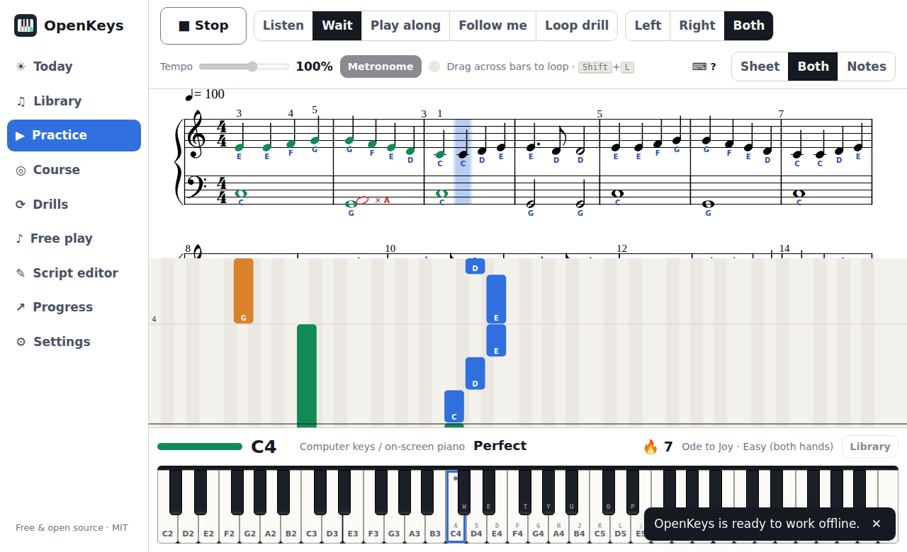

# OpenKeys

**A free, open-source piano teacher that runs entirely in your browser.** OpenKeys plays a piece with a real
grand-piano sound, listens to you play it (through the **microphone** or a **MIDI keyboard**), judges what you
played (notes, timing, held length and dynamics), and teaches with immediate, specific, encouraging feedback.

No account, no server, no tracking: **audio never leaves your device.** It installs as an app and works offline.



## What it does

- **Practice modes**: *Listen*, *Wait* (the music waits for the right notes: the best way to learn), *Play along*
  at 25–150 % tempo, *Follow me* (no fixed tempo: OpenKeys follows you, rubato and restarts included) and
  *Loop drill* (tempo rises 5 % after each clean pass). Hands separately or together; the app can play the other hand.
- **Feedback**: notes coloured in place on the sheet music (with ✓ ← → ✕ ○ ? shapes, never colour alone), red
  "ghost" noteheads showing what you actually played, a falling-notes view, results with stars, a bar-by-bar
  heatmap, your **top trouble spots** with a one-click "Practise this" loop, and pattern-level coaching such as
  *"Your left hand is consistently about 80 ms late"* or *"F♯ was played as F four times (check the key signature)"*.
- **Honest microphone judging**: single notes are detected precisely; chords use the score as a prior ("are the
  notes I expect sounding, freshly struck?"). When the microphone isn't sure, the verdict is **"?"** and never
  counts against you. See [docs/ACCURACY.md](docs/ACCURACY.md) for measured numbers.
- **Learning path**: a 7-lesson course (keyboard geography → five-finger position → reading → hands together →
  scales → triads → repertoire), generated drills (scales and arpeggios in any key with standard fingering,
  chord progressions, adaptive sight-reading, rhythm, ear training, a note-reading game), daily goal and streak,
  per-bar mastery, and spaced-repetition review of your trouble spots.
- **Your music**: import **MusicXML / MXL** (e.g. exported from MuseScore), **MIDI**, **ABC** and `.openkeys.json`
  by drag-and-drop. Repeats, voltas and D.C./D.S. are unrolled for judging while the sheet keeps its written layout.
  Write your own exercises in the built-in **ABC script editor**.
- **15 built-in pieces** (public-domain compositions arranged by the project): Ode to Joy, Für Elise (opening),
  Bach's Prelude in C, Gymnopédie No. 1, Minuet in G, Canon in D, Greensleeves and more, each in graded versions.
- **Free play** with a live piano roll; record a take and transcribe it, chords included, with Spotify's
  **Basic Pitch** running locally; save it as a score or download MIDI.

## Quick start

```sh
npm install
npm run dev        # http://localhost:5173 (first copies the piano samples and Basic Pitch model into public/)
npm run build      # static site in dist/ (deployed on Vercel; any static host works)
npm test           # unit + quick accuracy guards (Vitest)
npm run e2e        # Playwright end-to-end tests (fake microphone, MIDI-free paths)
npm run accuracy   # full detector accuracy suite; rewrites docs/ACCURACY.md (needs ffmpeg)
```

Microphone and Web MIDI need a **secure context**: `https://` or `http://localhost`.
Production deploys run on Vercel from `main` (settings in `vercel.json`); pull requests get preview deployments.
To serve from a sub-path instead of the domain root, build with `BASE=/<path>/ npm run build`.

## Browser support

| Browser | Microphone | MIDI keyboard |
| --- | --- | --- |
| Chrome / Edge (desktop, Android) | ✓ | ✓ (reference target) |
| Firefox | ✓ | ✓ after the site-permission prompt |
| Safari (macOS, iOS) | ✓ | ✗ Web MIDI isn't available; OpenKeys says so and offers the microphone |

## Hardware guide

OpenKeys was designed around the **Casio CT-S1** (61 keys, touch-sensitive, built-in speakers) but works with any
keyboard or acoustic piano.

### Microphone (no cable)

1. Put the laptop or tablet on the music stand, or a USB microphone 30–60 cm from the keyboard's speakers.
2. Choose **Settings → Input → Microphone** and run the **setup wizard** (about 2–3 minutes): room noise,
   timing (play along with 8 clicks), tuning (hold A4), range (lowest and highest key), soft/medium/loud, and
   optionally an **instrument profile** (one key every minor third) that makes chord detection more reliable.
3. Turn off your keyboard's **transpose** and **octave shift**, or tell OpenKeys about them (the wizard detects both).
4. Keep app playback in **headphones** in mic mode. By default OpenKeys mutes its own accompaniment so the
   microphone only hears you; the metronome click is filtered out of detection automatically.

**Most accurate without MIDI:** a cable from the keyboard's **headphone/line out** into an audio interface or
line input, then choose the *Line-in* preset. No room noise, no speaker colouring.

### MIDI over USB (exact)

The CT-S1 has a **USB Type-B "to host"** port. A standard USB-A-to-B (or USB-C-to-B) cable is all you need:
it appears as a class-compliant MIDI device with no driver.

1. Connect the cable and switch the keyboard on.
2. **Settings → Input → MIDI keyboard → Connect MIDI keyboard** and allow access.
3. Optional: run the wizard's timing and soft/loud steps to calibrate your velocity curve.
4. Optional: *send demos to the keyboard* plays OpenKeys' accompaniment through the CT-S1's own speakers (turn the
   app volume down, or set the keyboard's *Local Control* off, to avoid doubled notes).

With MIDI, notes, timing, velocity and the sustain pedal are exact. Bluetooth MIDI works if your operating
system exposes it as a normal MIDI port (e.g. a paired BLE-MIDI adapter).

### Building a test set from your own keyboard

Open the dev panel (`?debug`), connect the USB cable **and** enable the microphone, then press **Record
labelled take**: the MIDI stream becomes ground truth for the microphone recording. **Evaluate** scores the
detector on it; **Download** saves a WAV + JSON fixture.

## How it works (in one paragraph)

Every input (microphone, MIDI, computer keys) becomes the same stream of `NoteEvent`s on one clock, the
AudioContext's. The microphone is analysed in an **AudioWorklet** (spectral-flux + level-rise onsets, YIN/MPM
pitch, a multi-resolution log-frequency spectrum). A follower per practice mode turns events into verdicts;
play-along takes are re-solved as an assignment problem at the end so live guesses never distort the result.
Scores are always in beats; tempo maps convert to seconds. Everything in `src/core` is plain TypeScript with no
DOM, unit-tested with synthetic event streams and rendered audio. Design decisions are in
[docs/DECISIONS.md](docs/DECISIONS.md).

```
src/core/      score import, playback, input (mic, MIDI, virtual), calibration, follow, judge, progress, learn
src/worklets/  the real-time analysis AudioWorklet
src/ui/        React screens, sheet (OpenSheetMusicDisplay) and falling-notes views, dev panel
tests/         Vitest unit, follower and accuracy tests;   e2e/  Playwright
```

## Status and known limitations

- All eight milestones of the plan are implemented. The core is covered by unit tests (importers, tempo maths,
  repeat unrolling, matcher, followers, scoring, calibration, drills, progress) and Playwright tests (fake
  microphone, mocked Web MIDI, wait/play-along grading, lessons 1–3, offline reload).
- **Microphone accuracy is measured on real piano recordings and a simulated laptop microphone, not yet on a real
  CT-S1 in a real room.** See [docs/ACCURACY.md](docs/ACCURACY.md); real-instrument numbers will be added from
  labelled takes (dev panel → Takes).
- Automated browser tests run in Chromium. Firefox (mic + MIDI) and Safari (mic only) need a manual smoke test
  per release.
- Follow-me mode tracks one position at a time; very free interpretations or skipping whole sections can confuse it
  (press Stop and start again from the bar you want).

## Licence and credits

OpenKeys is released under the [MIT licence](LICENSE). The piano is the **Salamander Grand Piano** by Alexander
Holm (CC-BY 3.0). Full credits for samples and libraries: [CREDITS.md](CREDITS.md).
Contributions welcome: see [CONTRIBUTING.md](CONTRIBUTING.md).
